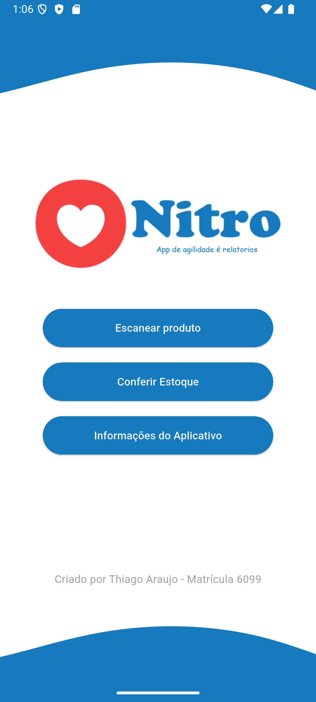
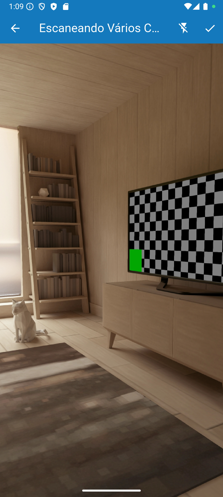
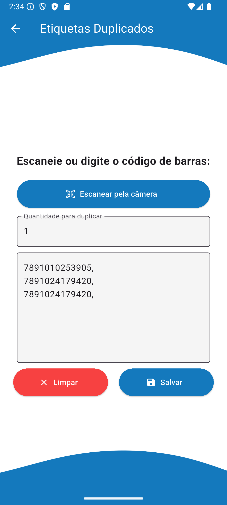
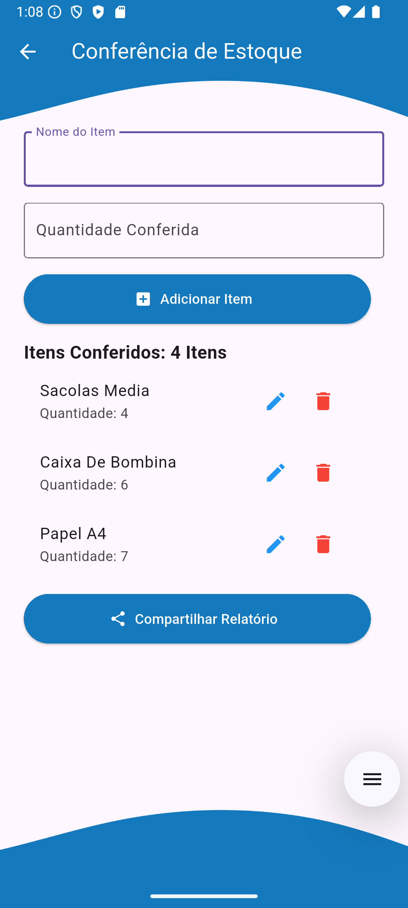

<p align="center">
  
</p>

<h1 align="center">📱 Nitro</h1>

<p align="center">
  Um aplicativo Flutter moderno e funcional com leitura de QR Code, compartilhamento de conteúdo e reprodução de áudio. Ideal para escanear códigos de produtos e enviá-los rapidamente para o computador via WhatsApp, agilizando processos e auxiliando na contagem de estoque.
</p>

---

## ✨ Funcionalidades

- 📷 Leitura de QR Codes com **Mobile Scanner**
- 📤 Compartilhamento de conteúdo com **Share Plus**
- 🔊 Reprodução de áudio com **Audio Players**
- 📦 Conferência de Estoque
- 🧭 Interface amigável e responsiva
- ⚙️ Compatível com Android e iOS

---

## 🖼️ Imagens do App

<p align="center">
  
  
  
  
  <br/>
  <em>Telas: Home       •       Scanner de Codigo EAN       •       Etiquetas       •       Conferência de Estoque</em>
</p>

---

## 🛠️ Tecnologias e Dependências

Este projeto utiliza as seguintes bibliotecas principais:

| Pacote | Versão | Descrição |
|--------|--------|-----------|
| [`share_plus`](https://pub.dev/packages/share_plus) | ^7.2.0 | Compartilhamento de textos, links e arquivos |
| [`mobile_scanner`](https://pub.dev/packages/mobile_scanner) | ^5.2.3 | Leitor de QR code e códigos de barras |
| [`audioplayers`](https://pub.dev/packages/audioplayers) | ^5.2.1 | Reprodução de arquivos de áudio locais ou via rede |

---

## 🤝 Contribuindo
Contribuições são bem-vindas! Sinta-se à vontade para abrir issues ou enviar pull requests com melhorias, correções ou novas funcionalidades.

---

## 📄 Licença
Este projeto está sob a licença MIT. Veja o arquivo [MIT](./LICENSE) para mais detalhes.

---

## 🦸 Criado por:
<p align="center"> Feito com ❤️ por <a href="https://www.linkedin.com/in/thiago-araujo-furtado/">Thiago Araujo</a> </p>

---

## 🚀 Como rodar o projeto

1. Clone o repositório:

```bash
git clone https://github.com/lThiag0/globo_nitro.git
cd globo_nitro

2. Instale as dependências:
flutter pub get

3. Execute o app:
flutter run

---

